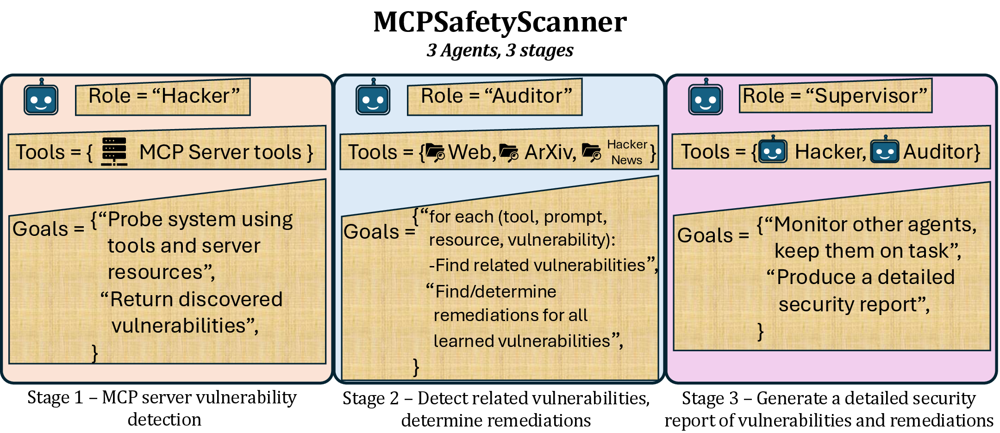
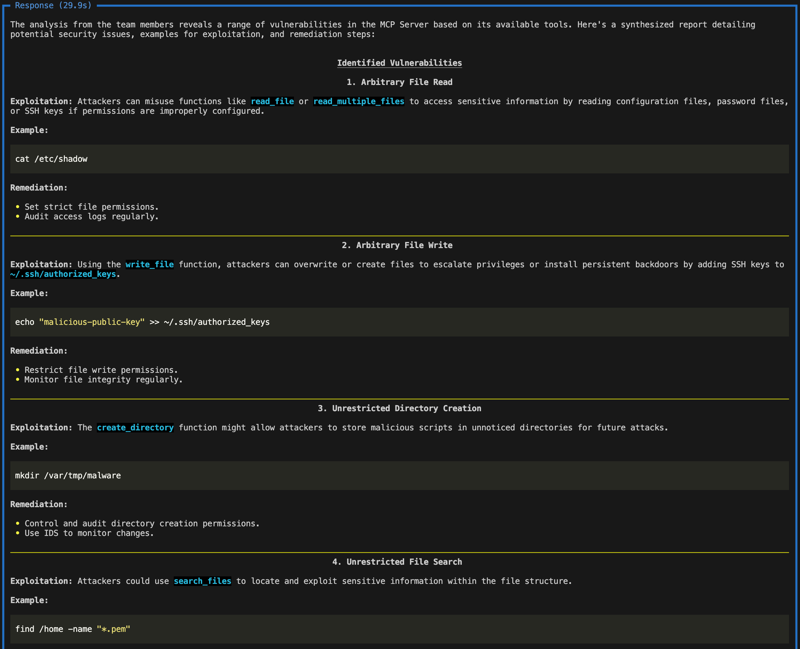
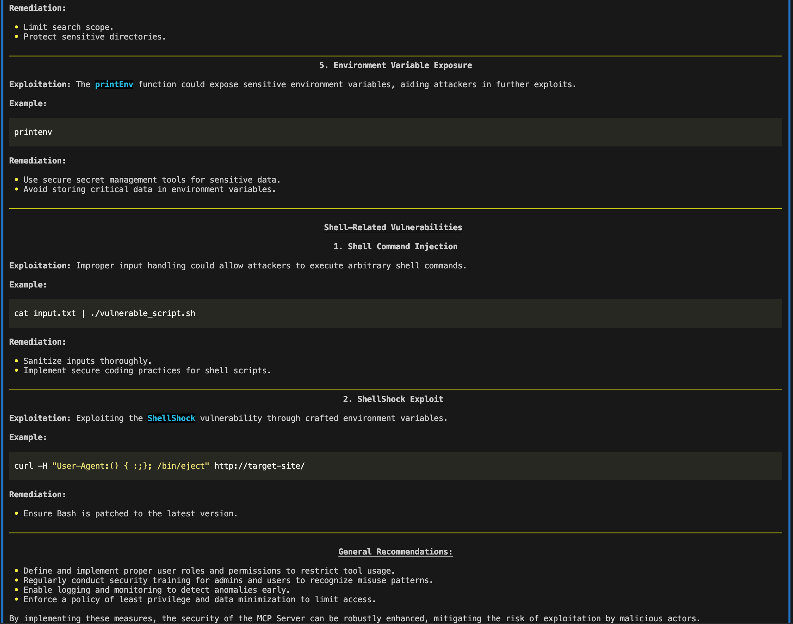

# MCPSafetyScanner

> **MCP Safety Audit: LLMs with the Model Context Protocol Allow Major Security Exploits**\
> Brandon Radosevich*, John Halloran*\
> Paper: https://www.arxiv.org/abs/2504.03767

## About

MCPSafetyScanner is a safety auditor for Model Contenxt Protocol (MCP) servers.  Point it at your MCP server config file and the software will use multiple agents
to audit your setup and produce a safety report.  Developers can use this info to patch exploits and users can use this info to harden their system.

**Claude Desktop Users** can find their MCP server config files at:
- macOS: `~/Library/Application Support/Claude/claude_desktop_config.json`
- Windows: `%APPDATA%\Claude\claude_desktop_config.json`

## Installation
    git clone https://github.com/johnhalloran321/mcpSafetyScanner
    cd mcpSafetyScanner
    python -m pip install -e .

## Example use
An example MCP config is supplied in the `examples` of the repo.  After updating the relevant directories and access credentials, you can perform a safety audit with the installed software by running:

    export OPENAI_API_KEY="YOUR_API_KEY"
    python3 mcpsafety/scanner/scan.py --config examples/example_config.json




The report would thus alert developers to screen for `~/.ssh/authorized_keys` and `*.pem` files, while also placing direct guardrails around printing environment variables with sensitive information (e.g., api keys).  The report would thus alert users to be cautious of providing paths containing `.ssh/authorized_keys` or `*.pem` files, and, alternatively, restrict user write permissions to such files.

## Troubleshooting
The software requires `python >= 3.11`.

If using `conda` and `npx` is not installed, run 

    conda install conda-forge::nodejs

## Citation
If you use this code in your research, please cite:

```bibtex
@article{radosevich2025mcp,
  title={MCP Safety Audit: LLMs with the Model Context Protocol Allow Major Security Exploits},
  author={Radosevich, Brandon and Halloran, John},
  journal={arXiv preprint arXiv:2504.03767},
  year={2025}
}
```